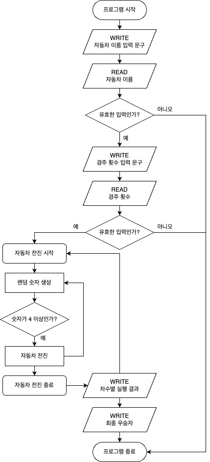

# ⚙️ '자동차 경주' 기능 목록

### ✅ 진행 상황 확인

- 🔴 진행 전
- 🟡 진행 중
- 🟢 진행 완료
- 🔵 리팩토링

### 🔗 Workflow



<br />

### 🟢 1. 자동차 이름 입력

- ✏️ 기능 설명

  사용자가 경주할 자동차 이름을 입력한다.

- 🚫 유의 사항

  - 자동차 이름은 `쉼표(,)`를 기준으로 구분한다.
  - 자동차 이름은 `5자 이하`만 가능하다.
  - 사용자의 값을 입력 받기 위해서는 `Console.readLineAsync`를 활용한다.
  - 출력을 위해서는 `Console.print`를 활용한다.
  - 사용자가 잘못된 값을 입력한 경우 `throw` 문을 사용해 `[ERROR]`로 시작하는 메시지를 가지는 예외를 발생시킨 후, 애플리케이션을 종료한다.

- 🔍 예시

  - 1️⃣ 문구 출력

          경주할 자동차 이름을 입력하세요.(이름은 쉼표(,) 기준으로 구분)

  - 2️⃣ 사용자 입력

          pobi,woni,jun

  - 3️⃣ 유효성 검사

          [ERROR] 입력이 5자 이하가 아닙니다.

### 🟢 2. 경주 횟수 입력

- ✏️ 기능 설명

  사용자는 몇 번의 이동을 할 것인지를 입력한다.

- 🚫 유의 사항

  - 횟수는 `숫자`로 입력되어야 한다.
  - 사용자의 값을 입력 받기 위해서는 `Console.readLineAsync`를 활용한다.
  - 출력을 위해서는 `Console.print`를 활용한다.
  - 사용자가 잘못된 값을 입력한 경우 `throw` 문을 사용해 `[ERROR]`로 시작하는 메시지를 가지는 예외를 발생시킨 후, 애플리케이션을 종료한다.

- 🔍 예시

  - 1️⃣ 문구 출력

          시도할 횟수는 몇 회인가요?

  - 2️⃣ 사용자 입력

          5

  - 3️⃣ 유효성 검사

          [ERROR] 입력이 숫자가 아닙니다.

### 🟢 3-1. 랜덤 숫자 생성

- ✏️ 기능 설명

  0에서 9 사이의 무작위 값을 구한다.

- 🚫 유의 사항

  - 1에서 9 사이의 숫자를 추출한다.
  - Random 값 추출은 `Random.pickNumberInRange()`를 활용한다.

### 🟢 3-2. 자동차 전진

- ✏️ 기능 설명

  자동차는 무작위 값이 4 이상일 경우 전진한다.

- 🚫 유의 사항

  - 자동차는 전진하거나 멈출 수 있다.
  - 자동차는 무작위 값이 `4 이상`일 경우 전진한다.

### 🟢 4. 실행 결과 출력

- ✏️ 기능 설명

  각 차수별 실행 결과를 출력한다.

- 🚫 유의 사항

  - 자동차의 실행 결과를 `-`를 이용해 표시한다.
  - 자동차의 실행 결과를 출력할 때 `자동차 이름`을 같이 출력한다.
  - 출력을 위해서는 `Console.print`를 활용한다.

- 🔍 예시

        pobi : -
        woni :
        jun : -

        pobi : --
        woni : -
        jun : --

### 🟢 5. 최종 우승자 출력

- ✏️ 기능 설명

  자동차 경주 게임을 완료한 후 최종 우승자를 출력하고 애플리케이션을 종료한다.

- 🚫 유의 사항

  - 우승자는 한 명 이상일 수 있다.
  - 우승자가 여러 명일 경우 `쉼표(,)`를 이용하여 구분해서 출력한다.
  - 출력을 위해서는 `Console.print`를 활용한다.

- 🔍 예시

  ```
  최종 우승자 : pobi
  ```

  ```
  최종 우승자 : pobi, jun
  ```

<br/>

# 📆 '자동차 경주' 구현 계획

<table>
<thead>
<th style="text-align: center">날짜</th>
<th style="text-align: center">구현 사항</th>
<th style="text-align: center">추정 시간</th>
<th style="text-align: center">상태</th>
<th style="text-align: center">실제 시간</th>
</thead>
<tr>
<td>10월 28일 (토)</td>
<td>기능 구현 목록 정리 및 기능 목록 1, 2 구현</td>
<td>3 Hours</td>
<td style="text-align: center">🟢</td>
<td>4 Hours</td>
</tr>
<tr>
<td>10월 29일 (일)</td>
<td>기능 목록 3, 4 구현</td>
<td>5 Hours</td>
<td style="text-align: center">🟢</td>
<td>3 Hours</td>
</tr>
<tr>
<td>10월 30일 (월)</td>
<td>기능 목록 5 구현 및 테스트</td>
<td>2 Hours</td>
<td style="text-align: center">🟢</td>
<td>5 Hours</td>
</tr>
<tr>
<td>10월 31일 (화)</td>
<td>코드 점검 및 리팩토링</td>
<td>2 Hours</td>
<td style="text-align: center">🔴</td>
<td>-</td>
</tr>
<tr>
<td>11월 01일 (수)</td>
<td>과제 제출</td>
<td>1 Hours</td>
<td style="text-align: center">🔴</td>
<td>-</td>
</tr>
</table>
